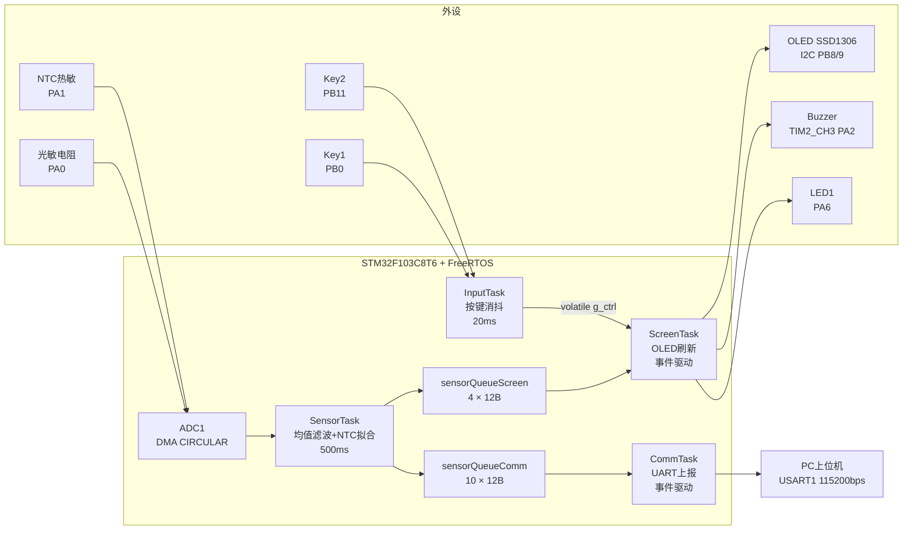

# STM32-RTOS 环境监测终端

基于 STM32F103C8T6 + FreeRTOS 的四任务环境监测系统，采集光照强度与温度，通过 OLED 本地显示并支持串口上位机监控。

## 实物展示


## 系统架构



### 任务设计

| 任务 | 优先级 | 周期 | 栈大小 | 职责 |
|------|--------|------|--------|------|
| **InputTask** | High | 20ms | 512B | 按键扫描消抖，更新 `g_ctrl` 全局控制状态 |
| **SensorTask** | AboveNormal | 500ms | 512B | ADC 均值滤波，NTC 二次曲线拟合，阈值判定 |
| **CommTask** | Normal | 事件驱动 | 1024B | 串口格式化输出传感器数据到上位机 |
| **ScreenTask** | BelowNormal | 事件驱动 | 512B | OLED 实时刷新亮度/温度/报警状态 |

### 任务间通信

```
InputTask ──g_ctrl (volatile全局变量)──→ ScreenTask  (控制OLED开关/报警使能)
SensorTask ──sensorQueueScreen (4×12B)──→ ScreenTask   (传感器数据)
SensorTask ──sensorQueueComm  (10×12B)─→ CommTask     (传感器数据)
```

| 通信方式 | 适用场景 | 选择原因 |
|----------|---------|---------|
| 消息队列 | 传感器数据推送 | 流式数据不能丢帧，每个消费者独立消费 |
| volatile 全局变量 | 按键控制信号 | 覆盖式写入，允许丢失中间值，原子性足够 |

## 硬件接线

| 外设 | 接口 | 引脚 | 说明 |
|------|------|------|------|
| 光敏电阻 | ADC1_IN0 | PA0 | 分压电路，0-3.3V |
| NTC 热敏电阻 | ADC1_IN1 | PA1 | 10K 上拉，B=3950 |
| OLED SSD1306 | I2C1 | PB8-SCL, PB9-SDA | 0.96寸 128x64 |
| Key1 | GPIO Input | PB0 (上拉) | 切换 OLED 显示开关 |
| Key2 | GPIO Input | PB11 (上拉) | 切换报警使能 |
| Buzzer | TIM2_CH3 PWM | PA2 | 动态变频报警音 |
| LED1 | GPIO Output | PA6 | 报警指示灯 |
| LED2 | GPIO Output | PA7 | 心跳指示灯 |
| USART1 | UART | PA9-TX, PA10-RX | 115200bps, 上位机通信 |

## 软件架构

```
STM32-RTOS/
├── App/Task/               # FreeRTOS 任务实现
│   ├── InputTask.c         #   按键扫描 (20ms周期)
│   ├── SensorTask.c        #   传感器采集处理 (500ms周期)
│   ├── ScreenTask.c        #   OLED 显示刷新
│   └── CommTask.c          #   串口数据上报
├── Hardware/               # 外设驱动层
│   ├── AD.c/h              #   ADC + DMA 初始化与校准
│   ├── Key.c               #   按键消抖状态机
│   ├── OLED.c/h            #   SSD1306 OLED 驱动
│   ├── OLED_Font.c/h       #   字库
│   ├── Serial.c/h          #   串口收发 + 中断回调
│   ├── LED.c/h             #   LED 控制
│   └── Buzzer.c/h          #   蜂鸣器 PWM 报警 (软件定时器变频)
├── Global/                 # 全局共享状态
│   ├── app_state.c/h       #   ControlData_t 全局控制结构体
├── Core/                   # STM32CubeMX 生成
│   ├── Inc/                #   外设头文件
│   └── Src/                #   外设初始化 + main.c + freertos.c
├── Drivers/                # STM32 HAL 库 + CMSIS
└── Middleware/             # FreeRTOS 内核 (v10.3.1)
```

### 关键设计决策

**1. DMA CIRCULAR 循环模式**
- 双通道 × 10 深度缓冲区，DMA 自动回绕写，CPU 零参与
- `AD_Init()` 只在任务启动后调用一次，避免重复启动导致 HAL_BUSY
> 踩坑记录：[调试过程遇到的问题与修复](#调试过程遇到的问题与修复)

**2. NTC 温度计算**
- 用二次曲线拟合替代 `logf()` 浮点对数运算
- STM32F1 无硬件 FPU，`logf` 软件模拟耗时大，拟合仅需乘加指令

**3. 蜂鸣器报警**
- FreeRTOS 软件定时器每 10ms 动态修改 TIM2 的 ARR 值
- 实现 PWM 频率扫描，产生"滴-滴"变调报警音

**4. 串口指令协议**
- 帧格式：`0xAA + OLED_State(0/1) + 0xFF + 0x0D + 0x0A`
- UART 中断 + 状态机解析，支持上位机远程切换 OLED 显示

## 构建与烧录

### 环境

- **IDE**: Keil MDK v5
- **代码生成**: STM32CubeMX
- **调试器**: ST-Link / J-Link (SWD)
- **编译**: ARM Compiler 5/6

### 步骤

1. 用 Keil MDK 打开 `MDK-ARM/RTOS_Test1.uvprojx`
2. 编译 (F7)，确认 0 Error
3. 连接 ST-Link，下载 (F8)
4. 上电后 OLED 显示 "Brightness: xx% Temp: xx.x°C"

### 串口上位机

- 波特率 115200，8N1
- 数据格式：`B:xx% T:xx.x Trigger:0/1\r\n`
- 上位机 Python 脚本

## 浏览器快速预览

| 文件 | 说明 |
|------|------|
| [freertos.c](Core/Src/freertos.c) | FreeRTOS 任务创建、队列定义 |
| [main.c](Core/Src/main.c) | 系统时钟配置、外设初始化、调度器启动 |
| [AD.c](Hardware/AD.c) | ADC 校准 + DMA 启动逻辑 |
| [Buzzer.c](Hardware/Buzzer.c) | PWM 变频报警实现 |
| [FreeRTOSConfig.h](Core/Inc/FreeRTOSConfig.h) | 内核参数配置 |


# ：调试过程遇到的问题与修复

---

> 在基于 FreeRTOS 的传感器采集项目中，定位并修复了 ADC 连续模式 + CIRCULAR DMA 下的系统启动卡死问题，通过系统性排查排除了时间基、错误中断、DMA 状态冲突等多种假设，最终综合调整校准流程和缓冲区配置使系统稳定运行。


**STM32F103 ADC+DMA 连续模式下系统卡死的排查与修复**

**项目背景：** 基于 FreeRTOS + STM32CubeMX 的嵌入式传感器采集项目，使用 ADC 连续转换模式 + CIRCULAR DMA 采集光敏电阻和 NTC 热敏电阻双通道数据，通过 FreeRTOS 消息队列将数据发送至 OLED 显示任务。

**问题现象：** 系统上电后 OLED 无任何显示，整个系统无响应。调试发现程序卡死在 `AD_Init()` 函数中。将 CubeMX 中 ADC 连续模式关闭后，系统立即恢复正常。

**排查过程：**

1. **排查时间基问题：** 确认项目使用 TIM4 作为 HAL 时间基（非 SysTick），`HAL_GetTick()` 始终有效，校准函数的 10ms 超时机制正常工作，排除校准函数无限等待的可能性。

2. **排查 ADC 错误中断：** 注册 `HAL_ADC_ErrorCallback` 回调并设置断点，程序运行期间该回调从未被触发，确认无 ADC 溢出（OVR）或 DMA 传输错误。

3. **排查 DMA 状态冲突：** 编写测试代码在循环中重复调用 `HAL_ADC_Start_DMA`，系统仍然正常运行，`HAL_ADC_ErrorCallback` 依然未被触发，验证 HAL 库状态机处理无问题。

4. **综合修复：** 在 CubeMX 重新生成代码时，对比新旧版本差异，一次性应用了以下三项修复：
   - **开启 ADC 校准**：旧版跳过了 `HAL_ADCEx_Calibration_Start` 调用
   - **增大 DMA 缓冲区深度**：缓冲区从 2 个元素扩至 20 个元素
   - **增加错误返回值检查**：对校准和 DMA 启动函数增加 `HAL_OK` 检验
   - 将采样周期从 1.5 Cycles 调至 55.5 Cycles，释放 70% 以上总线带宽

**修复结果：** 修复后系统正常启动，连续模式下 ADC + DMA 稳定运行，双通道数据以 50ms 周期通过消息队列传输至显示任务，无丢帧或卡顿。

**技术收获：**
- 深入理解了 STM32F1 的 ADC 校准流程对系统启动稳定性的影响
- 掌握了 ADC 连续模式下 DMA CIRCULAR 缓冲区的设计要点（传输计数 CNDTR 与回绕频率的平衡）
- 学会了 CubeMX 生成代码与手动代码之间的衔接管理（哪些部分会被覆盖、哪些保留）
- 积累了嵌入式系统调试的系统性方法论：先排除常见原因，再缩小范围，控制变量逐步验证

---

## 关键词

STM32F103、FreeRTOS、ADC、DMA CIRCULAR、STM32CubeMX、HAL 库、系统调试、控制变量法、OLED 显示、传感器采集

## License

MIT
